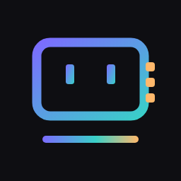

<div align="center">



# Kimi Code CLI — lacrous fork

**Bring-your-own-provider builds for Kimi Code CLI.**

[](https://github.com/MoonshotAI/kimi-code)
[](LICENSE)
[](#provenance)

A fork of [MoonshotAI/kimi-code](https://github.com/MoonshotAI/kimi-code) focused on making
**any OpenAI-compatible endpoint a first-class provider**, without a registry, without a
catalog entry, and without hand-writing model metadata.

</div>

---

## What this fork changes

Upstream already supports importing providers from a **custom registry** (`api.json`) and from
the public **models.dev catalog**. Both require a registry document to exist somewhere. This
fork adds the missing third path: **you type the endpoint, it discovers the models itself.**

| | Upstream | This fork |
|---|---|---|
| Import from `api.json` registry | ✅ | ✅ |
| Import from models.dev catalog | ✅ | ✅ |
| **Add a provider by hand** (`--type` + `--base-url` + key) | ❌ | ✅ `kimi provider add-manual` |
| **Models auto-discovered from the endpoint** | ❌ | ✅ `GET {baseUrl}/models` |
| **Built-in vendors** (17 — see the table below) | ❌ | ✅ `kimi provider add-builtin <id>` |
| **Change a provider's endpoint, protocol or key later** | ❌ | ✅ `kimi provider edit <id>` |
| **Pick a provider in the TUI** (`/provider` → Add provider) | ❌ | ✅ asks for the key, discovers models, picks a default |

The same flow is available in both places — `/provider` → **Add provider** → pick a
vendor, or from the command line with `kimi provider add-builtin <id>`.

### Built-in providers

All 17 are configured the same way — `kimi provider add-builtin <id> --api-key "$KEY"`, or
`--api-key-env VAR` to read the key from the environment instead of storing it.

| Id | Vendor | Endpoint | Wire |
|---|---|---|---|
| `cline` | Cline | `https://api.cline.bot/api/v1` | openai |
| `openrouter` | OpenRouter | `https://openrouter.ai/api/v1` | openai |
| `opencode-zen` | OpenCode Zen | `https://opencode.ai/zen/v1` | openai |
| `opencode-go` | OpenCode Go | `https://opencode.ai/zen/go/v1` | openai |
| `nvidia` | NVIDIA | `https://integrate.api.nvidia.com/v1` | openai |
| `nara` | NaraRouter | `https://router.bynara.id/v1` | openai |
| `tokenharbor` | Token Harbor | `https://tokenharbor.ai/v1` | openai |
| `openai` | OpenAI | `https://api.openai.com/v1` | openai |
| `anthropic` | Anthropic | `https://api.anthropic.com` | anthropic |
| `gemini` | Google Gemini | `https://generativelanguage.googleapis.com/v1beta` | google-genai |
| `grok` | xAI Grok | `https://api.x.ai/v1` | openai |
| `groq` | Groq | `https://api.groq.com/openai/v1` | openai |
| `qwen` | Qwen | `https://dashscope-intl.aliyuncs.com/compatible-mode/v1` | openai |
| `minimax` | MiniMax | `https://api.minimax.io/v1` | openai |
| `deepseek` | DeepSeek | `https://api.deepseek.com` | openai |
| `mistral` | Mistral | `https://api.mistral.ai/v1` | openai |
| `huggingface` | Hugging Face | `https://router.huggingface.co/v1` | openai |

Anthropic and Gemini are not plain OpenAI-compatible: Anthropic takes `x-api-key` plus a
pinned `anthropic-version` and its model list lives at `/v1/models` (the chat base is a bare
host), and Gemini returns `{models:[{name}]}` with the key in `x-goog-api-key`. The
discovery path handles both, so `add-builtin` needs no vendor-specific flags.

Built-ins skip the models.dev catalog entirely, so they work when models.dev is unreachable —
which is the case in a dev build, since the release-time catalog snapshot is not present.

> **One caveat on model discovery.** `/models` returns model ids and little else, and cannot
> express a *per-model protocol*. OpenCode Zen serves part of its catalog over the Anthropic
> Messages API; models.dev marks those models, but a plain `/models` fetch cannot see it. Those
> models are listed and may fail on first use. Import Zen from the catalog
> (`kimi provider catalog add opencode`) if you need the per-model protocol honored.

### `kimi provider add-manual`

Configure any OpenAI-compatible endpoint and discover its models in one step:

```sh
kimi provider add-manual my-gateway \
  --type openai \
  --base-url https://gateway.example.com/v1 \
  --api-key "$MY_GATEWAY_KEY"
```

```
Added provider "my-gateway" (type=openai, base_url=https://gateway.example.com/v1).
Discovering models from the endpoint…
  - my-gateway/llama-4-70b
  - my-gateway/qwen3-max
  - my-gateway/mistral-large-2

Set a default with: kimi --model my-gateway/llama-4-70b
```

To keep the key out of `config.toml`, bind it to an environment variable instead:

```sh
kimi provider add-manual my-gateway \
  --type openai \
  --base-url https://gateway.example.com/v1 \
  --api-key-env MY_GATEWAY_KEY
```

#### Options

| Flag | Required | Description |
|---|---|---|
| `--type <type>` | yes | Wire protocol: `openai`, `openai_responses`, or `kimi` |
| `--base-url <url>` | yes | Base URL, e.g. `https://gateway.example.com/v1` |
| `--api-key <key>` | one of | Inline key. Falls back to `KIMI_REGISTRY_API_KEY` |
| `--api-key-env <VAR>` | one of | Read the key from this environment variable |

`anthropic` and `google-genai` are accepted: both vendors do expose a model-list route
(`GET /v1/models` with `x-api-key` + `anthropic-version`, and Google's
`{models:[{name}]}` with `x-goog-api-key`), and the discovery path speaks both.

**Discovery is best-effort, never silent.** If `{baseUrl}/models` is unreachable or returns
401, the provider is still saved and the command exits non-zero with instructions for
declaring models manually. You are never left with a provider that looks configured but
cannot resolve a model.

### `kimi provider add-builtin <id>`

Configure any built-in vendor non-interactively — endpoint and protocol already set:

```sh
kimi provider add-builtin cline --api-key "$CLINE_API_KEY"
kimi provider add-builtin openrouter --api-key "$OPENROUTER_API_KEY"
kimi provider add-builtin nvidia --api-key-env NVIDIA_API_KEY
```

`--api-key-env` keeps the key out of `config.toml`; the value is read from that environment
variable at request time.

Models are always read live from the vendor's `/models` route, never from a hardcoded list, so
a built-in tracks the vendor's current catalog. Several of these vendors are also importable
from the models.dev catalog (`kimi provider catalog add openrouter`, `... add nvidia`), which is
worth preferring when you want the catalog's richer per-model metadata.

### `kimi provider edit <id>`

Change a provider that is already configured — a rotated key, a moved endpoint, a different
protocol:

```sh
kimi provider edit openai --api-key "$OPENAI_API_KEY"
kimi provider edit mygw --base-url https://gateway.example.com/v1
kimi provider edit mygw --type openai_responses
kimi provider edit mygw --api-key-env GATEWAY_KEY   # stop storing the key inline
kimi provider edit mygw --base-url https://x.test/v1 --no-refresh
```

| Flag | Effect |
|---|---|
| `--type <type>` | New wire protocol (`openai`, `openai_responses`, `anthropic`, `google-genai`, `kimi`) |
| `--base-url <url>` | New endpoint. Must be `http(s)` |
| `--api-key <key>` | New inline key. Falls back to `KIMI_REGISTRY_API_KEY` |
| `--api-key-env <VAR>` | Read the key from this variable instead of storing it inline |
| `--no-refresh` | Apply the change without re-reading the model list |

Only the flags you pass are touched; everything else on the provider record is left as it was.
Three details worth knowing:

- **The edit is applied in place**, so existing model aliases and your `default_model` survive.
  Removing and re-adding would drop both and silently repoint the next session.
- **`--api-key` and `--api-key-env` replace each other**, not accumulate — the config rejects a
  record carrying both. Passing both flags at once is an error.
- **A failed refresh does not roll back the edit.** The change is saved, the error is reported,
  and the previous model list stays intact, so a wrong key is a one-flag fix rather than a
  re-add.

---

## How discovery works

Upstream's refresh orchestrator had four branches for maintaining a provider's model list:
managed OAuth, first-party platforms, managed-endpoint API keys, and custom registries. A
provider you typed in by hand matched none of them — `model_source = "discover"` existed in
the config schema but no code path ever acted on it.

This fork adds a fifth branch. For any provider with a declared `base_url`, no `oauth`
reference, and no registry `source`, it fetches `{base_url}/models` and writes one alias per
model.

**Design decisions worth knowing:**

- **One implementation, not two.** The CLI command does not reimplement discovery — it writes
  the provider record and delegates to the same engine refresh the TUI uses. A provider added
  from the CLI refreshes identically to one added from the TUI.
- **The provider record is user-owned.** Discovery rewrites *only* model aliases. It never
  touches the `base_url` or the credential you configured.
- **Declared-but-absent metadata gets conservative defaults.** Many OpenAI-compatible servers
  return bare `{ id }` rows. Those models still become usable aliases rather than being
  rejected.
- **Providers that other branches already own are excluded.** The managed Kimi endpoint and
  the synthetic `__kimi_env__` provider (injected by the `KIMI_MODEL_*` env overlay) are
  explicitly skipped, so discovery never double-fetches or clobbers them.
- **Embedding entries are dropped.** Endpoints routinely mix embedding and fine-tune models
  into `/models`; those cannot drive a chat turn and are skipped rather than offered.

### Discovery payload shapes accepted

| Endpoint returns | Handling |
|---|---|
| `{ "data": [{ "id": "..." }] }` | ✅ OpenAI standard |
| `[{ "id": "..." }]` | ✅ bare array |
| `{ "id": "...", "context_length": 200000 }` | context window read from the row |
| `object: "embedding"` rows | skipped — not usable for chat |

---

## Install

This fork is **not published to npm or the VS Code marketplace** — upstream's publishing
pipelines were intentionally removed from this repository so that nothing attempts to publish
under your account. Build and run it from source:

```sh
git clone https://github.com/lacrous/kimi-code-by-lacrous.git
cd kimi-code-by-lacrous
pnpm install
pnpm build
node apps/kimi-code/dist/main.mjs --version
```

> **Clone tip:** this is a GitHub fork, so a default clone also pulls upstream's inherited
> history (~90 MB). If you only want the code, not the 4,000-odd upstream commits, clone the
> `lite` branch instead — same 4,426 files, single squashed commit, **~27 MB**:
>
> ```sh
> git clone --branch lite --single-branch https://github.com/lacrous/kimi-code-by-lacrous.git
> ```
>
> Both branches have byte-identical content; only the history differs.

For the **official, signed release**, use upstream's installer — it is the maintained
distribution channel and is unaffected by this fork:

```sh
curl -fsSL https://code.kimi.com/kimi-code/install.sh | bash
```

Requires Node.js ≥ 24.15.0 and pnpm 10.33.0.

---

## Develop

```sh
pnpm kimi          # run THIS checkout's CLI (not an installed binary)
pnpm dev:cli       # run the CLI in dev mode
pnpm test          # run tests
pnpm typecheck     # TypeScript check
pnpm lint          # oxlint (includes the no-comments guard)
pnpm build         # build all packages
```

`pnpm run kimi -- provider list` and `pnpm run kimi` (interactive) run the code in this
checkout. It sets `KIMI_CODE_HOME` to a repo-local `.kimi-dev-home/`, so a dev run never reads
or writes an installed `kimi`'s config at `~/.kimi-code/`. Override it to share that config
instead:

```sh
KIMI_CODE_HOME="$HOME/.kimi-code" pnpm run kimi -- provider list
```

Run the provider tests specifically:

```sh
npx vitest run apps/kimi-code/test/cli/provider.test.ts
npx vitest run packages/agent-core-v2/test/app/kosongConfig/discovery.test.ts
```

Architecture, coding rules, and contribution guidance live in [AGENTS.md](AGENTS.md) and
[CONTRIBUTING.md](CONTRIBUTING.md) — both inherited from upstream and still accurate for this
fork.

---

## Provenance

This repository is a fork of **[MoonshotAI/kimi-code](https://github.com/MoonshotAI/kimi-code)**,
an AI coding agent that runs in your terminal.

- **Upstream:** Moonshot AI · MIT License · [upstream repo](https://github.com/MoonshotAI/kimi-code) ·
  [upstream issues](https://github.com/MoonshotAI/kimi-code/issues)
- **Fork maintained by:** lacrous · <https://github.com/lacrous/kimi-code-by-lacrous>
- **Fork base commit:** `21406fb4c`
- **Branches:** `main` (canonical, full history) · `lite` (same content, squashed to one commit,
  ~70% smaller clone)
- **Changes in this fork:** model discovery for hand-written providers, 17 built-in vendors,
  `kimi provider add-manual`, `kimi provider add-builtin`, the `/provider` built-in flow,
  model-id search in the picker, `pnpm run kimi`, and removal of upstream's release/publish
  workflows. See [CREDITS.md](CREDITS.md) for the per-file breakdown.
- **This fork is not affiliated with or endorsed by Moonshot AI.** Kimi, Kimi Code, and
  related names and marks are the property of their respective owner.

All upstream code remains under the MIT License; see [LICENSE](LICENSE). Upstream
documentation is at
[moonshotai.github.io/kimi-code](https://moonshotai.github.io/kimi-code/en/).

To pull upstream changes in, add the upstream remote and merge:

```sh
git remote add upstream https://github.com/MoonshotAI/kimi-code.git
git fetch upstream && git merge upstream/main
```

## Acknowledgements

- **Moonshot AI** for Kimi Code CLI, the foundation of this fork.
- [`pi-tui`](https://github.com/earendil-works/pi-mono/tree/main/packages/tui) — upstream's
  TUI layer, used under its original license.

## License

MIT, unchanged from upstream. Copyright (c) 2026 Moonshot AI. See [LICENSE](LICENSE).
