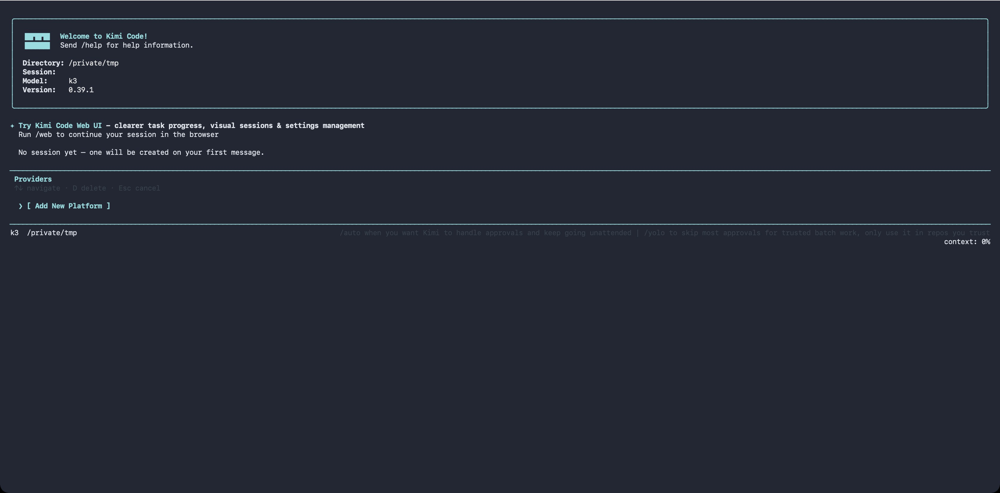

# 平台与模型

Lacrous Kimi Code CLI 支持同时接入多家模型供应商服务，模型在供应商之上声明自己的名称、上下文长度和能力。本页介绍如何在 `config.toml` 里配置各种供应商。

## 支持的供应商类型

`providers` 表里的 `type` 字段决定使用哪种协议实现：

| 类型 | 协议 | 典型用途 |
| --- | --- | --- |
| [`kimi`](#kimi) | OpenAI 兼容 | Lacrous Kimi Code 托管服务、Kimi Platform API 密钥 |
| [`anthropic`](#anthropic) | Anthropic Messages | Claude 系列模型 |
| [`openai`](#openai) | OpenAI Chat Completions | OpenAI 及兼容服务、DeepSeek、Qwen 等 |
| [`openai_responses`](#openai_responses) | OpenAI Responses API | OpenAI 较新的 Responses 接口 |
| [`google-genai`](#google-genai) | Google GenAI | Gemini API |
| [`vertexai`](#vertexai) | Google GenAI on Vertex | Google Cloud Vertex AI |

所有供应商默认以流式方式与模型交互。thinking、视觉、工具调用等能力按模型名前缀自动匹配，通常不需要手动声明。

**端点规则**：`base_url` 必须是 http(s)，且不得内嵌用户名或密码——密钥请写进 `api_key` / `api_key_env`，这样它才不会出现在配置文件、备份或调试输出里。明文 `http://` 只对密钥无法离开本机所在链路的主机放行，因为明文请求头会把凭证暴露给监听网络的人：`localhost` 与 `*.localhost`、任意 `*.local`（mDNS）名称、`127.0.0.0/8`、`::1`、`0.0.0.0`、`::`，以及私有网段 `10.0.0.0/8`、`172.16.0.0/12`、`192.168.0.0/16`、`169.254.0.0/16`，还有 IPv6 的 `fc00::/7`、`fe80::/10`。部署在公网主机上的网关必须使用 `https`；如果某个公网主机确实只提供明文服务，并且你愿意承担暴露风险，可以设置 `KIMI_CODE_ALLOW_INSECURE_PROVIDER_HTTP=1`，在本次运行中恢复旧行为。

**凭证优先级**：`api_key` 或 `api_key_env`（互斥替代项，只能设置其中一个）> `[providers.<name>.env]` 子表键（两者都不存在时才读）> 全部缺失时启动报错。除显式声明的 `api_key_env` 外，CLI 不会从 shell 环境变量自动取凭证，详见[配置覆盖：供应商凭证](./overrides.md#供应商凭证)。

## `/provider` — 交互式供应商管理

不想手动编辑 TOML？在 TUI 里输入 `/provider` 打开**供应商管理器**，可以以交互方式添加或删除供应商。



管理器按来源把供应商显示为一行行条目。操作方式：

- ↑/↓ 移动光标，←/→ 翻页
- `e` 键替换当前供应商已保存的 API 密钥，按 `Enter` 确认——密钥全程不在屏幕上显示，并会用新密钥刷新该供应商的模型
- `d` 键删除当前供应商（有 `[y/N]` 确认）
- 在 `[ Add New Platform ]` 行按 Enter 添加新供应商

用账号而非 API 密钥认证的条目——`/login` 登录的 OAuth 平台——会拒绝该操作并提示改用 `/login`。它们的凭证来自登录会话，在这里手填的密钥会在下次会话刷新时被覆盖。Kimi 平台条目保存的是真实的 API 密钥，因此它的密钥在这里和其他供应商一样可以修改。

添加时有两条路径：

- **Known third-party provider**：从 [models.dev](https://models.dev/) 拉取模型目录，选供应商 → 输入 API 密钥 → 选默认模型。目录未声明协议类型的供应商（如 xai、openrouter 这类厂商专用 SDK）会按 OpenAI 兼容协议导入并显示 "guessed" 提示；目录没有可用端点时会先弹出 base URL 输入框；Amazon Bedrock / Cohere 等专有协议和无法识别的显式协议会被拒绝导入。已下线（deprecated）和 alpha 状态的模型不会出现在导入列表中。如果公共目录不可达，CLI 会回退到内置目录快照，离线或网络受限环境下也能完成导入
- **Custom registry (api.json)**：粘贴自定义 registry 地址，私有 registry 再附上 Bearer token，CLI 自动创建 `providers` / `models` 条目。当 registry 条目声明了 `env` 字段（存放 API 密钥的环境变量名）时，CLI 会把它作为提示打印出来——想用就在 `config.toml` 里自己设置 `api_key_env`。绑定永远不会自动发生：registry 既决定变量名、又决定凭证发往的端点，不能由它来选择读取你的哪份密钥。对私有 registry，Bearer token 本身仍会存为 `source.apiKey`，供刷新时重新拉取。后续启动时，同一个 registry 地址下的供应商会一起刷新，因此上游新增、删除供应商以及模型元数据变化都会同步。

::: warning
通过 `/login` 登录的 Lacrous Kimi Code OAuth 托管账号不会在 `/provider` 里显示，请用 `/login` 和 `/logout` 管理。
:::

非交互环境下也可以用 shell 命令完成同样操作：[`kimi provider`](../reference/kimi-command.md#kimi-provider)。

## 内置供应商

`/provider` 管理器的 "Known third-party provider" 路径会拉取公共模型目录再做适配，适用于目录中已经收录的厂商。对于下面这些厂商，CLI 已把端点、协议和密钥前缀都内置为数据，即使拉不到目录，你也能直接按 id 添加：

```sh
kimi provider add-builtin <providerId>
```

这条命令会替你写好一整条供应商配置——协议、`base_url` 以及你在提示中输入的 API 密钥——随后刷新它的模型列表。完成之后它就是一个普通供应商：可以像其他供应商一样修改、更换密钥或删除。

| Id | 名称 | 协议 | 密钥前缀 | 可接入的服务 |
| --- | --- | --- | --- | --- |
| `cline` | Cline | OpenAI 兼容 | — | 一把密钥接入 Anthropic、OpenAI、Google 等 |
| `openrouter` | OpenRouter | OpenAI 兼容 | — | 一把密钥调用多家供应商的 400+ 个模型 |
| `opencode-zen` | OpenCode Zen | OpenAI 兼容 | — | OpenCode 团队实测过的精选模型 |
| `opencode-go` | OpenCode Go | OpenAI 兼容 | — | Go 套餐下的 OpenCode Zen 模型 |
| `nvidia` | NVIDIA | OpenAI 兼容 | `nvapi-` | NVIDIA 托管的开放模型，开发者层级免费 |
| `nara` | NaraRouter | OpenAI 兼容 | `sk-nry-` | 价格实惠的多模型网关 |
| `tokenharbor` | Token Harbor | OpenAI 兼容 | `thk_live_` | 一把通用密钥接入多家 AI 供应商 |
| `openai` | OpenAI | OpenAI 兼容 | `sk-` | GPT、o 系列和 Codex 模型 |
| `anthropic` | Anthropic | Anthropic Messages | `sk-ant-` | Claude 模型 |
| `gemini` | Google Gemini | Google GenAI | `AIza` | Gemini 模型 |
| `grok` | xAI Grok | OpenAI 兼容 | `xai-` | Grok 模型 |
| `groq` | Groq | OpenAI 兼容 | `gsk_` | 跑在 Groq 硬件上的高速开放模型 |
| `qwen` | Qwen | OpenAI 兼容 | `sk-` | 阿里巴巴 Qwen 模型 |
| `minimax` | MiniMax | OpenAI 兼容 | — | MiniMax 模型 |
| `deepseek` | DeepSeek | OpenAI 兼容 | `sk-` | DeepSeek 对话与推理模型 |
| `mistral` | Mistral | OpenAI 兼容 | — | Mistral 与 Magistral 模型 |
| `huggingface` | Hugging Face | OpenAI 兼容 | `hf_` | 经 Hugging Face 路由访问的开放模型 |

密钥前缀只是提示里展示的参考，不是校验规则——厂商可能不打招呼就改前缀，而拒绝一把本来可用的密钥，比不显示任何提示更糟糕。

表格里还有两条情况没有写全。`anthropic` 和 `gemini` 都不接受 `Bearer` 请求头，因此 `add-builtin` 会为它们分别写入各自所需的 `auth_scheme`；在那里带上 `Bearer` 会返回 401，看起来和密钥失效一模一样。`opencode-zen` 在 OpenAI 兼容的 `/models` 接口上列出 Claude 模型，实际却通过 Anthropic Messages API 提供服务，因此这条配置把 `claude-*` 固定到该协议上——不固定的话，这些模型能列出来，一用就失败。

这些端点具体如何接收密钥，详见 [身份验证与凭证](./authentication.md)。

## `kimi`

用于对接 Moonshot AI 的 OpenAI 兼容接口，包括 Lacrous Kimi Code 托管服务和 Kimi Platform API 密钥。

- 默认 `base_url`：`https://api.moonshot.ai/v1`
- 凭证键名：`KIMI_API_KEY`、`KIMI_BASE_URL`
- 额外能力：支持视频上传

```toml
[providers.kimi]
type = "kimi"
base_url = "https://api.moonshot.ai/v1"
api_key = "sk-xxxxx"
```

> 使用 Lacrous Kimi Code 托管服务时，`/login` 登录后会自动配置 `base_url` 和凭证，无需手动填写。

## `anthropic`

用于对接 Claude API。标准 Claude 模型自动启用视觉、工具调用及 Thinking（如支持）；自定义或未覆盖的模型需在 `[models.<alias>]` 里显式声明 `capabilities`。

- 默认 `base_url`：跟随 Anthropic SDK 默认值
- 凭证键名：`ANTHROPIC_API_KEY`、`ANTHROPIC_BASE_URL`
- 默认 `max_tokens`：按模型自动推断。如需覆盖，在模型别名上设 `max_output_size`

```toml
[providers.anthropic]
type = "anthropic"
api_key = "sk-ant-xxxxx"

[models."claude-opus-4-7"]
provider = "anthropic"
model = "claude-opus-4-7"
max_context_size = 200000
# max_output_size = 32000  # 可选，省略时使用模型推断的默认值
```

## `openai`

用于对接 OpenAI Chat Completions 协议，也可连接任何兼容该协议的第三方服务（覆盖 `base_url` 即可）。

第三方推理模型（DeepSeek、Qwen、One API 等）开箱即用：CLI 自动处理 `reasoning_content` 字段和 `reasoning_effort` 注入。如果你的网关用非标准字段名返回推理内容，在模型别名上设 `reasoning_key` 覆盖。

- 默认 `base_url`：`https://api.openai.com/v1`
- 凭证键名：`OPENAI_API_KEY`、`OPENAI_BASE_URL`

```toml
[providers.openai]
type = "openai"
base_url = "https://api.openai.com/v1"
api_key = "sk-xxxxx"
```

### 自定义认证请求头与匿名访问

本小节说明 `openai` 供应商把 API 密钥放在哪里，以及如何关掉凭证。默认情况下密钥以 `Authorization: Bearer <key>` 发送，这也是 OpenAI 官方期望的形式。但本地服务器和第三方网关未必一致：有的从你指定的请求头里读密钥，有的则完全不校验。`auth_scheme` 子表就是在这些情况之间做选择。

- `kind = "bearer"` —— 以 `Authorization: Bearer <key>` 发送 API 密钥，这是默认行为；显式写出来是为了让配置意图一目了然
- `kind = "custom-header"` —— 把 API 密钥放进 `header` 指定的请求头，并且不发送 `Authorization` 头
- `kind = "none"` —— 完全不发送凭证，适用于不做校验的本地或自托管服务器

```toml
[providers.local-gateway]
type = "openai"
base_url = "http://localhost:8080/v1"

[providers.local-gateway.auth_scheme]
kind = "custom-header"
header = "x-api-key"
```

密钥的值仍然来自 `api_key` 或 `api_key_env`，`auth_scheme` 只改变凭证发送的位置，不改变凭证本身。`custom-header` 缺少 `header` 属于配置错误。

`auth_scheme` 同样适用于 `anthropic` 类型，在那里会以相同的方式替换 SDK 默认的 `x-api-key` 请求头。

::: warning 注意
`auth_scheme` 仅适用于 `openai`、`openai_responses` 和 `anthropic` 类型。写在 `google-genai` 或 `vertexai` 上会直接报配置错误，不会被静默忽略。
:::

## `openai_responses`

对应 OpenAI 较新的 Responses API，始终以流式方式工作。配置方式与 `openai` 相同，包括[自定义认证请求头与匿名访问](#自定义认证请求头与匿名访问)。

- 默认 `base_url`：`https://api.openai.com/v1`
- 凭证键名：`OPENAI_API_KEY`、`OPENAI_BASE_URL`

```toml
[providers.openai-responses]
type = "openai_responses"
base_url = "https://api.openai.com/v1"
api_key = "sk-xxxxx"
```

## `google-genai`

用于直连 Google Gemini API。thinking、视觉及多模态能力按模型名自动识别。

- 凭证键名：`GOOGLE_API_KEY`

```toml
[providers.gemini]
type = "google-genai"
api_key = "xxxxx"
```

如需经由兼容 Gemini 协议的代理/网关访问，可设置 `base_url`（或 `GOOGLE_GEMINI_BASE_URL` 环境变量）；不填时使用 SDK 默认地址 `https://generativelanguage.googleapis.com`。

> 只填**主机根地址**。Google GenAI SDK 会自行追加 API 版本与路径（如 `/v1beta/models/<model>:generateContent`），所以结尾带 `/v1beta` 会导致路径重复成 `/v1beta/v1beta/…`。

```toml
[providers.gemini]
type = "google-genai"
api_key = "xxxxx"
base_url = "https://your-gateway.example"
```

## `vertexai`

与 `google-genai` 共用实现，`type = "vertexai"` 时切换到 Vertex AI 访问路径。

认证走 Google Cloud 标准 ADC 流程（`gcloud auth application-default login` 或 `GOOGLE_APPLICATION_CREDENTIALS` 服务账号 JSON），这部分与 Lacrous Kimi Code 无关。**项目 ID 和区域必须写在 `[providers.vertexai.env]` 子表里**。直接在 shell 里 `export GOOGLE_CLOUD_PROJECT` 不会被 CLI 读取。

```toml
[providers.vertexai]
type = "vertexai"

[providers.vertexai.env]
GOOGLE_CLOUD_PROJECT = "my-gcp-project"
GOOGLE_CLOUD_LOCATION = "us-central1"
```

```sh
gcloud auth application-default login   # 一次性完成认证
kimi
```

如需让 Vertex 请求走自定义（如代理）端点，可设置 `base_url`（或 `GOOGLE_VERTEX_BASE_URL` 环境变量）；不填时使用 SDK 默认的区域化 `*-aiplatform.googleapis.com` 地址。与 `google-genai` 一样，只填主机根地址。SDK 会自行追加 `/v1beta1/publishers/google/models/…`。

## OAuth 与凭证注入

Lacrous Kimi Code 托管服务使用 OAuth 而不是静态 API 密钥。执行 `/login` 之后，内置的认证工具链会自动写入并刷新凭证，因此这一部分无需在 `config.toml` 里做任何手动配置。

## 下一步

- [配置文件](./config-files.md) — `providers` 和 `models` 表的完整字段参考
- [配置覆盖](./overrides.md) — 供应商凭证的解析优先级规则
- [环境变量](./env-vars.md) — 各供应商对应的凭证键名列表
